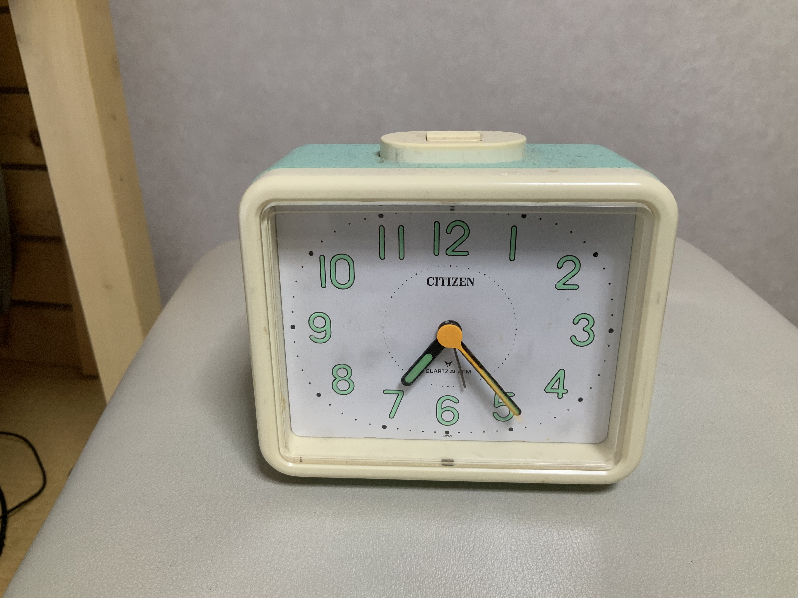

---
Keywords:
Copyright: (C) 2024 Hirofumi Murai
---

## Lern English and Bible

I will translate Japanese scriputures into English.

エホバ神は蛇に言った。「あなたはこうしたことを行ったので・・・卑しいものとなる。」(創3:14)

My trans: Jehovah said snake ... you will be unclean for bad things.-Gen.3:14

Official: Jehovah God said to the serpent:" Because you have done this,you are the cursed one".-Gene.3:14

##  Today's Picuture

This is the watch I bought when I started delivering newspapers.I've been using it for over 40 years.

