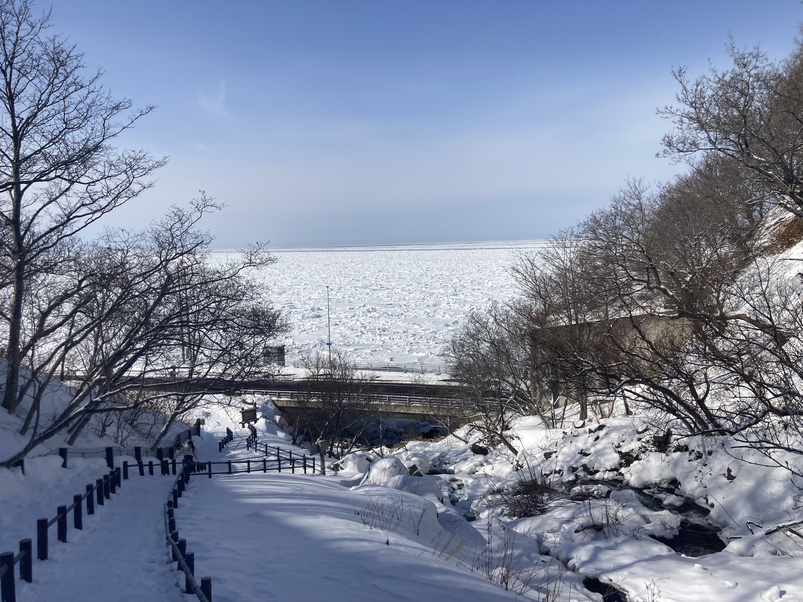

---
Keywords:
Copyright: (C) 2024 Hirofumi Murai
---

## Lern English and Bible

I will translate Japanese scriputures into English.

エホバ神は蛇に言った。「あなたはこうしたことを行ったので・・・卑しいものとなる。」(創3:14)

My trans:Be imitator to your God ,because you are loved for his children. 

Official: Becine unutatirs of Gos,as beloved children.-Eph.5:1

##  Today's Picuture

Shari-cho shari-gun ,Hokkaido 0994114 JAPAN

This is a waterfall called Oshinkoshin Falls.

It's full of drift ice.

